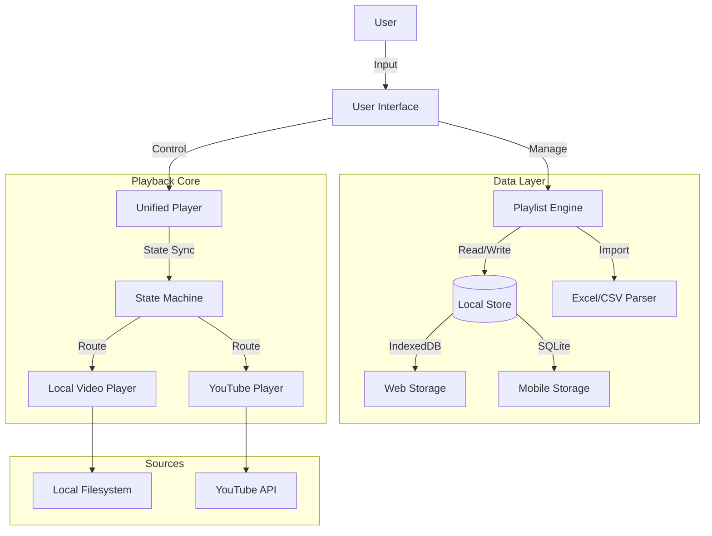

# Karaoke System Architecture & Design

## 1. System Overview

The Karaoke Organizer is a hybrid playback system supporting:
- **Local Playback**: Offline-first video files (MP4, MKV, AVI).
- **YouTube Playback**: Online streaming via IFrame/WebView.
- **Playlist Management**: Unified queue mixing both sources, ordered via Excel/CSV or manual input.

### High-Level Architecture



## 2. Data Model

### Playlist Item Interface
```typescript
type SourceType = 'LOCAL' | 'YOUTUBE';

interface PlaylistItem {
  id: string;              // UUID
  order: number;           // Sort order
  type: SourceType;
  title: string;
  artist: string;
  notes?: string;
  
  // Local Specific
  fileName?: string;       // e.g., "my_way.mp4"
  fileHandle?: File | string; // Web: File object, Mobile: URI string
  
  // YouTube Specific
  youtubeUrl?: string;
  youtubeId?: string;      // Extracted from URL
  
  duration?: number;       // Seconds
  status: 'READY' | 'MISSING' | 'ERROR' | 'PLAYING' | 'DONE';
}
```

### Playlist Queue
```typescript
interface Playlist {
  id: string;
  name: string;
  items: PlaylistItem[];
  currentIndex: number;
}
```

## 3. State Machine (Playback)

The unified player uses a state machine to handle transitions between Local and YouTube sources.

**States:**
- `IDLE`: No song playing.
- `LOADING`: Buffer/File load.
- `PLAYING_LOCAL`: HTML5 Video / Native Video active.
- `PLAYING_YOUTUBE`: VT Embed active.
- `PAUSED`: User paused.
- `TRANSITION`: Switching sources (countdown/loading).
- `ERROR`: Playback failed (skip logic triggers).

**Transitions:**
1. `NEXT_SONG` triggered -> Check `nextItem.type`.
2. If `LOCAL` -> Mount Local Player -> Load File -> `PLAYING_LOCAL`.
3. If `YOUTUBE` -> Mount YouTube Player -> Load ID -> `PLAYING_YOUTUBE`.
4. `ENDED` event from either player -> Trigger `Auto-Advance`.

## 4. Excel Integration Logic

**Columns Expected:**
- `Order` (Number)
- `Source` ("LOCAL" | "YOUTUBE")
- `Song Name` (String)
- `Artist` (String)
- `File Name` (String - Required if Source=LOCAL)
- `YouTube URL` (String - Required if Source=YOUTUBE)
- `Notes` (Optional)

**Validation Rules:**
1. `Source` matches regex `/^(LOCAL|YOUTUBE)$/i`.
2. If `LOCAL`, `File Name` must not be empty.
3. If `YOUTUBE`, `YouTube URL` must be valid and `ID` extractable.

## 5. Platform Specifics

### Web (Next.js)
- **Local Files**:
  - **Individual**: Standard `<input type="file" />`.
  - **Folder**: `<input type="file" webkitdirectory />`.
  - **Storage**: Store file references in memory (transient) or IndexedDB (requires user permission to persist/re-open handles in modern browsers, or generic upload mapping).
  - **YouTube**: `react-youtube` or raw IFrame API.

### Mobile (React Native)
- **Local Files**:
  - **Android**: Scoped Storage / SAF to pick directory. Index files inside.
  - **iOS**: Document Picker for folder/files.
  - **Storage**: SQLite for metadata.
- **YouTube**:
  - `react-native-youtube-iframe` (WebView wrapper).

## 6. Security & Legal 
- **YouTube**: No caching of streams. Always use official player. Handle region locks gracefully.
- **Local**: Read-only access to user-selected folders. No background uploads.

